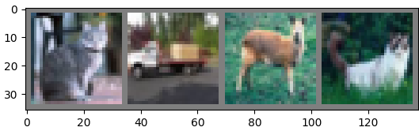

# Pytorch学习的笔记
Authour:王涛   Time:2020.11.14 22:13  
[快捷键](快捷键.md)
## 0. 反向传播原理
这里就不自己重写了，这一个网址中讲的特别清楚。 
###  [反向传播](https://blog.csdn.net/fsfjdtpzus/article/details/106256925)

## 00. 主要原理
 1. 首先对模型进行梯度清零
 2. 计算损失函数     ```loss=criterion(output,target) criterion = nn.MSELoss()```
 3. 损失函数梯度进行反向传播 ```loss.backward()```
 4. 进行参数更新  ```optimizer.step()```更新网络权重
 
 
     optimizer.zero_grad()   # zero the gradient buffers
    output = net(input)
    loss = criterion(output, target)
    loss.backward()
    optimizer.step()    # Does the update
 5. 更新权重有两种方法，上面的方法为集成采用优化器以进行更新。还有一种基础的反向传播。同样为梯度清零
 计算损失函数，反向传播。但是更新参数的时候为手动进行更新。例如：
``` learning_rate = 0.01
for f in net.parameters():
    f.data.sub_(f.grad.data * learning_rate)
```
## 1. 首先加载数据
加载数据的主要步骤为：
1. 设置数据集
2. 加载数据和查看数据
    ```
    trainset = torchvision.datasets.CIFAR10(root='./data', train=True,           #设置训练数据集
                                            download=True, transform=transform)  #transform为对数据进行的处理操作
    trainloader = torch.utils.data.DataLoader(trainset, batch_size=4,            #加载训练集数据，设置加载的参数
                                              shuffle=True, num_workers=2)       #设置线程
    
    testset = torchvision.datasets.CIFAR10(root='./data', train=False,
                                           download=True, transform=transform)
    testloader = torch.utils.data.DataLoader(testset, batch_size=4,
                                             shuffle=False, num_workers=2)
    
    classes = ('plane', 'car', 'bird', 'cat',
               'deer', 'dog', 'frog', 'horse', 'ship', 'truck')        #总共的类别数
    ```
   查看数据：
   ```
    import matplotlib.pyplot as plt
    import numpy as np
    # functions to show an image
    def imshow(img):
        img = img / 2 + 0.5     # unnormalize
        npimg = img.numpy()
        plt.imshow(np.transpose(npimg, (1, 2, 0)))
        plt.show()
    # get some random training images
    dataiter = iter(trainloader)
    images, labels = dataiter.next()
    # show images
    imshow(torchvision.utils.make_grid(images))
    # print labels
    print(' '.join('%5s' % classes[labels[j]] for j in range(4)))
    ```
    
## 2. 定义模型
```
import torch.nn as nn
import torch.nn.functional as F
class Net(nn.Module):
    def __init__(self):
        super(Net, self).__init__()
        self.conv1 = nn.Conv2d(3, 6, 5)
        self.pool = nn.MaxPool2d(2, 2)
        self.conv2 = nn.Conv2d(6, 16, 5)
        self.fc1 = nn.Linear(16 * 5 * 5, 120)
        self.fc2 = nn.Linear(120, 84)
        self.fc3 = nn.Linear(84, 10)
    def forward(self, x):
        x = self.pool(F.relu(self.conv1(x)))
        x = self.pool(F.relu(self.conv2(x)))
        x = x.view(-1, 16 * 5 * 5)
        x = F.relu(self.fc1(x))
        x = F.relu(self.fc2(x))
        x = self.fc3(x)
        return x
net = Net()
```     
2.1 定义模型优化器    

```import torch.optim as optim
criterion = nn.CrossEntropyLoss()
optimizer = optim.SGD(net.parameters(), lr=0.001, momentum=0.9)
```   
##3. 开始训练模型
   ```
   for epoch in range(40):  # loop over the dataset multiple times
        running_loss = 0.0
        for i, data in enumerate(trainloader, 0):
            # get the inputs; data is a list of [inputs, labels]
            inputs, labels = data
            # zero the parameter gradients
            optimizer.zero_grad()
            # forward + backward + optimize
            outputs = net(inputs)
            loss = criterion(outputs, labels)
            loss.backward()
            optimizer.step()
            # print statistics
            running_loss += loss.item()
            if i % 2000 == 1999:    # print every 2000 mini-batches
                print('[%d, %5d] loss: %.3f' %
                      (epoch + 1, i + 1, running_loss / 2000))
                running_loss = 0.0
   print('Finished Training')
   ```
   保存模型，以及对应的两种加载方法：
   ```
   PATH = './cifar_net.pth'      # 第一种方法
   torch.save(net.state_dict(), PATH)
   model = TheModelClass(*args, **kwargs)  #加载模型时先定义模型
   model.load_state_dict(torch.load(PATH)) #然后加载模型的权重
   model.eval()
   torch.save(model, PATH)       # 第二种方法，直接保存整个模型
   model = torch.load(PATH)                #然后直接加载模型，同上一种不同的是，不用再加载字典
   model.eval()
   ---------------------------------------------------------------
   torch.save({                  # 第一种的实用写法，同时保存了优化器中的参数设置
            'epoch': epoch,
            'model_state_dict': model.state_dict(),
            'optimizer_state_dict': optimizer.state_dict(),
            'loss': loss,
            ...
            }, PATH)
   model = TheModelClass(*args, **kwargs)
   optimizer = TheOptimizerClass(*args, **kwargs)
   checkpoint = torch.load(PATH)
   model.load_state_dict(checkpoint['model_state_dict'])
   optimizer.load_state_dict(checkpoint['optimizer_state_dict'])
   epoch = checkpoint['epoch']
   loss = checkpoint['loss']    
   model.eval()
    # - or -
   model.train()
   ```
## 4. 测试模型
首先加载测试图像：
```
dataiter = iter(testloader)
images, labels = dataiter.next()
outputs = net(images)                 #这时，每一张图像在每个类别上都有一个预测概率(网络输出十个)
_, predicted = torch.max(outputs, 1)  #  取概率最大的为预测结果
correct = 0
total = 0
with torch.no_grad():                 #在整个数据集上进行测试
    for data in testloader:           #测试时设置不要梯度，torch.no_grad()
        images, labels = data
        outputs = net(images)
        _, predicted = torch.max(outputs.data, 1)
        total += labels.size(0)
        correct += (predicted == labels).sum().item()
Accuracy = correct/total

```

