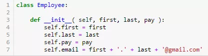
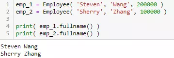
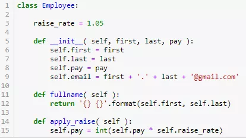
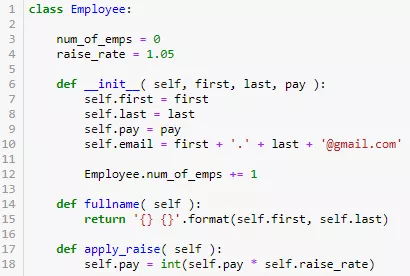
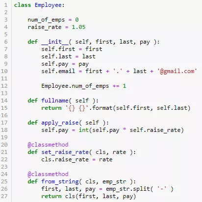
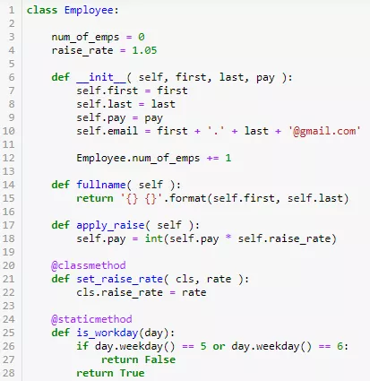
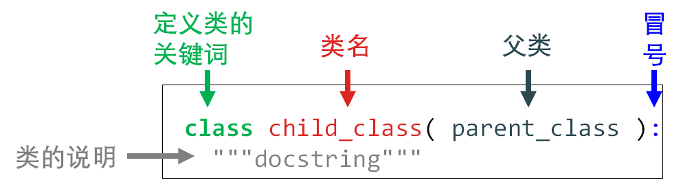

## 常用快捷键
1. 任意处折叠代码ctrl+.
2. 展开、收缩代码CTRL+-，CTRL++
3. 增加行 shift+Enter
4. 快速大小写转换： CTRL+shift+U
5. 历史剪切板：CTRL+shift+V
6. 查看函数可用参数：CTRL+P
7. 快速预览用法文档：CTRL+Q
8. 对代码添加try：CTRL+alt+T
9. 功能强大的自定义格式代码：Live Template 
10. 自动封装选定的代码：CTRL+alt+M 

设置文件ssh密钥：
ssh-keygen -t rsa -C "15608099197@163.com"
cat ~/.ssh/id_rsa.pub

初始化，建立.git文件： git init  
查看哪些文件没有提交过库：git status  
添加到库：git add .(添加整个当前文档) git add x.py 添加大哥文件  
提交： git commit -m "description"  
推送： git push origin master  
克隆远地仓库，自己指定文件名：git clone https://github.com/libgit2/libgit2 mylibgit  

python中的重要知识:
1. 对象.方法() == 类.方法(对象)
2. 封装、抽象、继承、多态  
封装：使用def __init__(self,first,last,pay):   将方法集中起来   
  
第一个参数一定是self，表示在创建对象本身。然后实例化对象：    
  
更复杂的定义类:  

3. 通过类改变类变量，则定义的属性中的对象变量也会改变。反之则不会。
4. 通过定义类，可以方便的统计创建的类的对象数,每当创建一个变量，则类中的对象数变量就加一  

5. 类方法和静态方法  
  
不加修饰符定义的类为`实例方法`，加classmethod为类方法   
类方法必须为：clf,self 可以实现改变类的变量值(数量)  
  
加staticmethod为静态方法，不能有clf，self.只能实现特定的功能
6. 继承和多态  
从子类看父类，其关系为继承，从父类看子类为多态。一下为子类的写法：  

7. 

